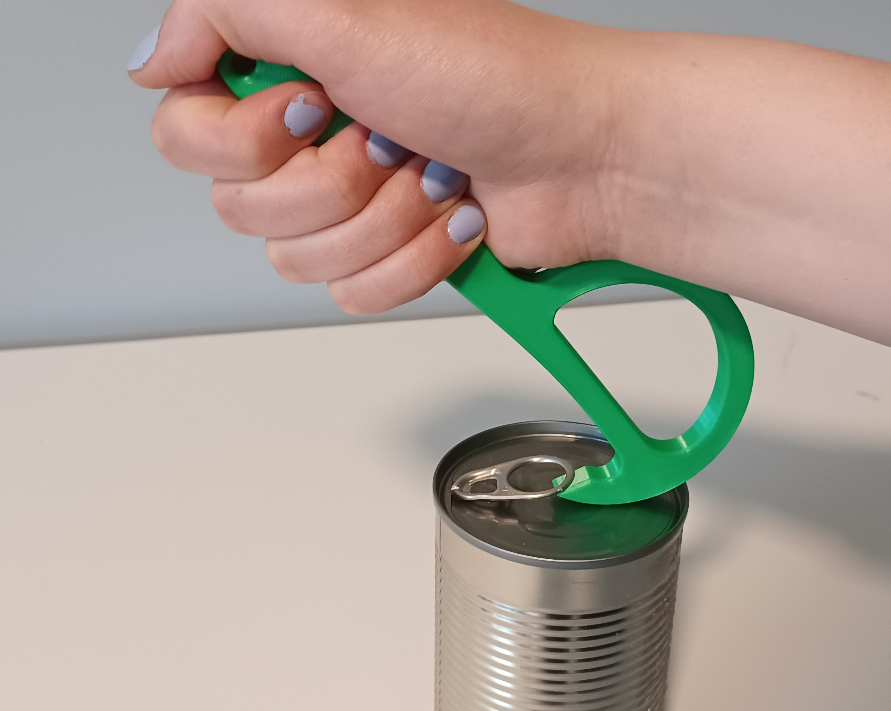

# Pull-Tab Tin Can Opener
The Pull-Tab Tin Can Opener is a device to help those with arthritis, limited finger dexterity or limited finger strength open tin cans with pull-tabs.

## More info at
- [Makers Making Change Project Page](<https://makersmakingchange.com/project/pull-tab-tin-can-opener/>)

## How to Obtain a Pull-Tab Tin Can Opener
### 1. Do it Yourself (DIY) or Do it Together (DIT)

This is an open-source assistive technology, so anyone is free to build it. All of the files and instructions required to build the Pull-Tab Tin Can Opener are contained within this repository. Refer to the Maker Checklist below.

### 2. Request a build of this device

If you would like to obtain a Pull-Tab Tin Can Opener, you may submit a build request through the [MMC Library Page](https://makersmakingchange.com/project/device-name/pull-tab-tin-can-opener/). The requestor is responsible for the cost of materials and any shipping.

### 3. How to build this device for someone else

If you have the skills and equipment to build this device, and would like to donate your time to create the switch for someone who needs it, visit the [MMC Maker Wanted](https://makersmakingchange.com/maker-wanted/) section.

## Getting Started

### 1. Read the [Makers Checklist](/Documentation/Pull-Tab_Tin_Can_Opener_Maker_Checklist_V1.0.pdf).

### 2. Print the 3D Printable components.

All of the files and individual print files can be in the [/Build_Files/3D_Printing_Files](/Build_Files/3D_Print_Files/) folder.

Reference the [3D Printing Guide](/Documentation/Pull-Tab_Tin_Can_Opener_3D_Printing_Guide_V1.0.pdf) for the tools and steps required to build each portion.

## Files
### Documentation
| Document             | Version | Link |
|----------------------|---------|------|
| Maker Checklist      | 1.0     | [Pull-Tab_Tin_Can_Opener_Maker_Checklist](/Documentation/Pull-Tab_Tin_Can_Opener_Maker_Checklist_V1.0.pdf)     |
| Bill of Materials    | 1.0     | [Pull-Tab_Tin_Can_Opener_Bill_of_Materials](/Documentation/Pull-Tab_Tin_Can_Opener_BOM_V1.0.csv)     |
| 3D Printing Guide    | 1.0     | [Pull-Tab_Tin_Can_Opener_3D_Printing_Guide](/Documentation/Pull-Tab_Tin_Can_Opener_3D_Printing_Guide_V1.0.pdf)     |
| User Guide           | 1.0     | [Pull-Tab_Tin_Can_Opener_User_Guide](/Documentation/Pull-Tab_Tin_Can_Opener_User_Guide_V1.0.pdf)    |
| Changelog            | 1.0     | [Pull-Tab_Tin_Can_Opener_Changelog](/Documentation/Pull-Tab_Tin_Can_Opener_Changelog_V1.0.pdf)     |
| Summary              | 1.0     | [Pull-Tab_Tin_Can_Opener_Summary](/Documentation/Pull-Tab_Tin_Can_Opener_Summary_V1.0.pdf)     |

### Build Files
 - [3D Printing Files](/Build_Files/3D_Print_Files)

## Attribution
Designers:
Design by Printlab user 4xsample under the CC0 license.
Documentation by Neil Squire / Makers Making Change under the CC BY SA 4.0 license.

## License
Everything needed or used to design, make, test, or prepare the Pull-Tab Tin Can Opener is licensed under the CERN 2.0 Permissive license <https://ohwr.org/project/cernohl/wikis/Documents/CERN-OHL-version-2> (CERN-OHL-P) . 

 <Pull-Tab Tin Can Opener> by <a xmlns:cc="http://creativecommons.org/ns#" href="www.makersmakingchange.com" property="cc:attributionName" rel="cc:attributionURL">Neil Squire</a> is licensed under a <a rel="license" href="http://creativecommons.org/licenses/by-sa/4.0/">Creative Commons Attribution-ShareAlike 4.0 International License</a>.

---
<!-- ABOUT MMC START -->
## About Makers Making Change

Makers Making Change is a program of [Neil Squire](https://www.neilsquire.ca/), a Canadian non-profit that uses technology, knowledge, and passion to empower people with disabilities.

Makers Making Change leverages the capacity of community based Makers, Disability Professionals and Volunteers to develop and deliver affordable Open Source Assistive Technologies.

 - Website: [www.MakersMakingChange.com](https://www.makersmakingchange.com/)
 - GitHub: [makersmakingchange](https://github.com/makersmakingchange)
 - Bluesky: [@makersmakingchange.bsky.social](https://bsky.app/profile/makersmakingchange.bsky.social)
 - Instagram: [@makersmakingchange](https://www.instagram.com/makersmakingchange)
 - Facebook: [makersmakechange](https://www.facebook.com/makersmakechange)
 - LinkedIn: [Neil Squire Society](https://www.linkedin.com/company/neil-squire-society/)
 - Thingiverse: [makersmakingchange](https://www.thingiverse.com/makersmakingchange/about)
 - Printables: [MakersMakingChange](https://www.printables.com/@MakersMakingChange)

### Contact Us
For technical questions, to get involved, or to share your experience we encourage you to [visit our website](https://www.makersmakingchange.com/) or [contact us](https://www.makersmakingchange.com/s/contact).
<!-- ABOUT MMC END -->
